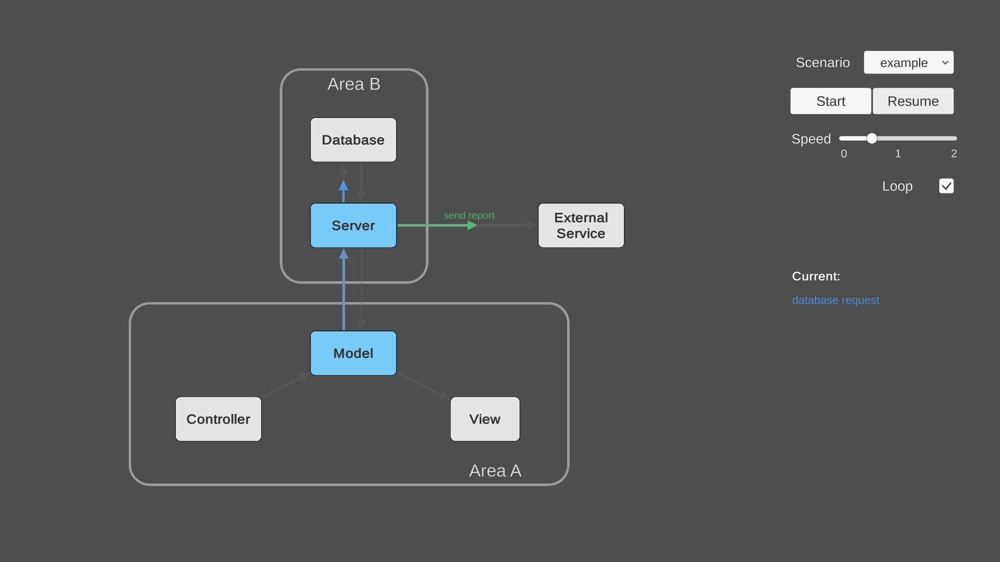

# process-visualizer

## Get Started
Want to visualize a process involving nodes/components/services which are dynamically connected by arrows?
- Simply build the graph visually as a Unity UI with the `ProcessNode` and `ProcessArrow` prefabs.
- Describe arbitrary processes in JSON format separated from the logic and visualization in Unity.
- Control your process flow with a simple UI.

## Building your process
TODO

## JSON Description
TODO
